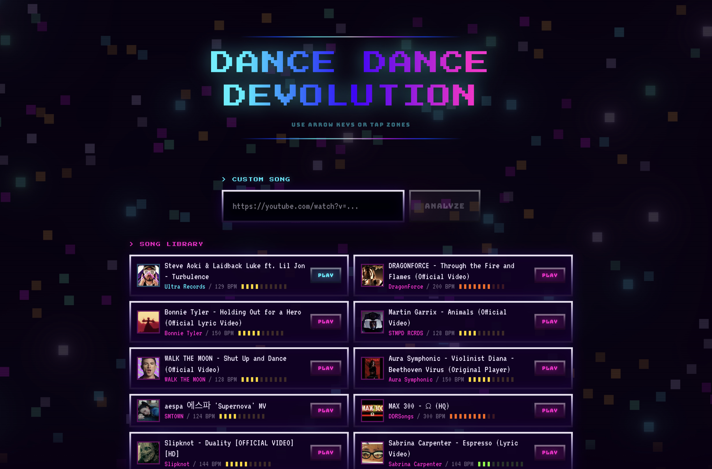
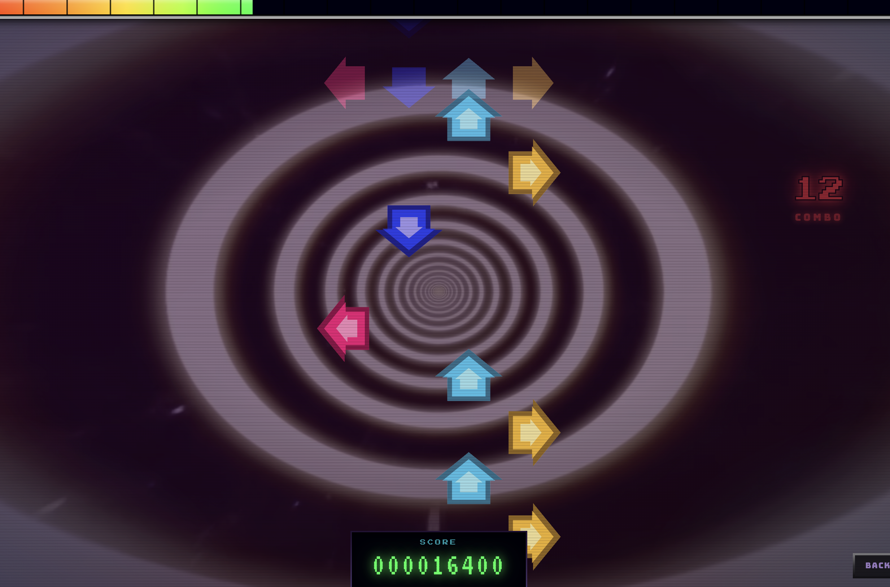
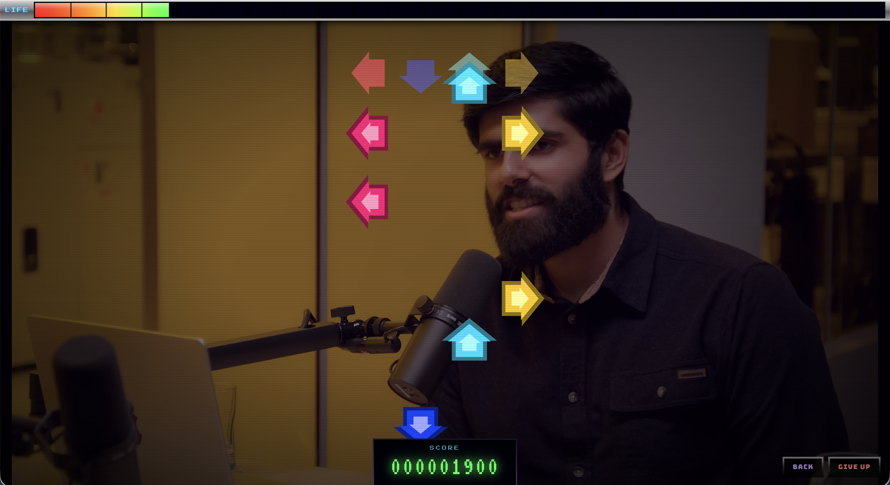
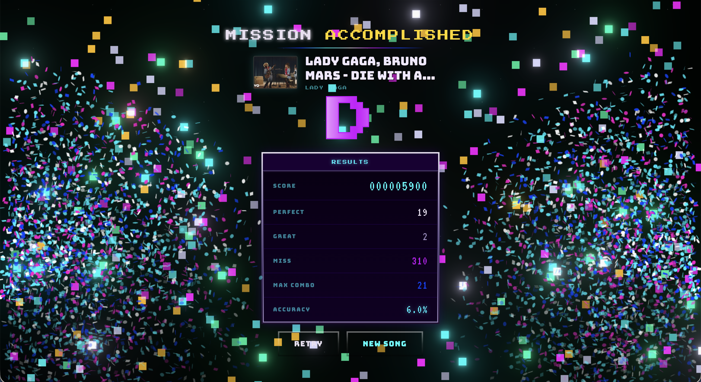

# Dance Dance Devolution

DDR-style rhythm game with Three.js + WebGPU

Pick pre-loaded songs or paste a YouTube URL (<10 min). For YouTube, extracts audio with `yt-dlp`, analyzes beats with `librosa`, and generates a step chart.

The backend detects the tempo and individual hits in the audio, picks a **high-energy 60–90s segment** from the music, then places arrows on the beats. Faster songs with more hits automatically get harder charts. Arrow directions follow shuffled patterns so the same song always produces the same chart.